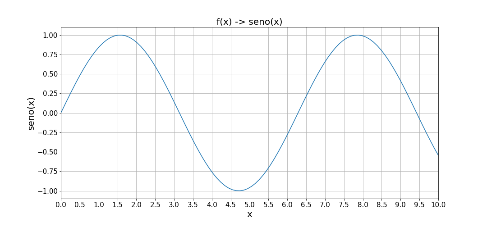

# MATPLOTLIB: Visualicación de Datos en Python

_Presentamos un Jupyter NoteBook con la información esencial sobre visualicación de datos para n00bs_




### Pre-requisitos 📋

_Tener instalado en nestro equipo Python_

_Librerías de Python utilizadas:_

```
- matplotlib
- numpy
- pandas
```

### Instalación 🔧

_Para instalar Python:_


```
https://www.python.org/downloads/
```

_Para instalar librerías:_

```
https://youtu.be/HlmUaYKjjZc
```

## Autores ✒️

_Autores del proyecto:_

* **Errodringer** - *Programación y edición* - [Errodringer](https://www.youtube.com/c/Errodringer?sub_confirmation=1)

## Licencia 📄

Este proyecto es divulgativo. Solo para uso personal, aprendizaje y entretenimiento.

## Expresiones de Gratitud 🎁

* Muchas gracias a todos!
* Comenta a otros sobre este proyecto y difunde! 📢
*  🤓

